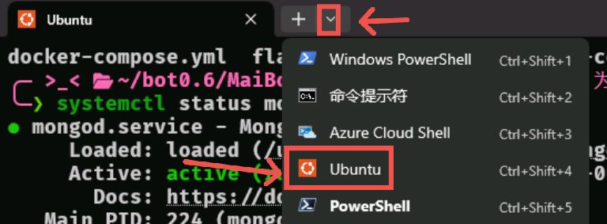

# 十三启动指南

## 方法一

### 一：启动数据库

这一步我已经设置了自启动，可以不管，但还是说，运行以下命令查看数据库状态：

```zsh
systemctl status mongod
```

输出应有：

```
Active: active (running)
```

如果不一样，运行以下命令：

```zsh
systemctl start mongod
```

接下来数据库就会在后台默默运行了。

### 二：启动napcat

你可以先打开浏览器进入：
```
http://127.0.0.1:6099/
```
token是`napcat`，以确定是否已经启动napcat。

如果可以进入并已登录，请忽略下面的步骤。

输入以下命令启动napcat并登录到十三：

```zsh
napcat start 2704945442
```

接下来浏览器进入：
```
http://127.0.0.1:6099/
```
以确定是否启动成功。

如果你需要在终端查看日志，请运行：

```zsh
tmux new -s 终端名（如：qq）
```

后运行：

```zsh
napcat log 2704945442
```

之后`ctrl B`后按`D`即可让这个终端在后台运行，想查看日志时运行：

```zsh
tmux att -t 你设置的终端名
```

即可回到后台的终端，`ctrl B`后按`D`可继续让终端在后台运行。

### 三：启动十三本体

再次创建一个新终端：

```zsh
tmux new -s 终端名
```

进入bot0.6目录：

```zsh
cd ~/bot0.6
```

进入虚拟环境：

```zsh
source maibot/bin/activate
```

进入MaiBot目录：

```zsh
cd MaiBot
```

启动十三本体：

```zsh
nb run
```

接下来就可以让该终端在后台运行了。

### 四：启动连接qq用的另一个机器人（不知道为什么要分开）

同样，创建一个新终端：

```zsh
tmux new -s 终端名
```

进入bot0.6目录：

```zsh
cd ~/bot0.6
```

进入虚拟环境：

```zsh
source maibot/bin/activate
```

进入nonebot-maibot-adatper目录：

```zsh
cd nonebot-maibot-adatper
```

启动：

```zsh
nb run
```

同样可以放在后台运行。

我们的十三也就启动成功了。

## 方法二

### 一：启动数据库

与方法一一样。

### 二：启动napcat
你可以先打开浏览器进入：
```
http://127.0.0.1:6099/
```
token是`napcat`，以确定是否已经启动napcat。

如果可以进入并已登录，请忽略下面的步骤。

输入以下命令启动napcat并登录到十三：

```zsh
napcat start 2704945442
```

接下来浏览器进入：
```
http://127.0.0.1:6099/
```
以确定是否启动成功。

如果你需要在终端查看日志，请运行：

```zsh
napcat log 2704945442
```

### 三：启动十三本体

与方法一一样，但可忽略创建终端这一步，只需重新打开一个标签页。

进入bot0.6目录：

```zsh
cd ~/bot0.6
```

进入虚拟环境：

```zsh
source maibot/bin/activate
```

进入MaiBot目录：

```zsh
cd MaiBot
```

启动十三本体：

```zsh
nb run
```

### 四：启动连接qq用的另一个机器人

与方法一一样，但可忽略创建终端这一步，只需重新打开一个标签页。

进入bot0.6目录：

```zsh
cd ~/bot0.6
```

进入虚拟环境：

```zsh
source maibot/bin/activate
```

进入nonebot-maibot-adatper目录：

```zsh
cd nonebot-maibot-adatper
```

启动：

```zsh
nb run
```

